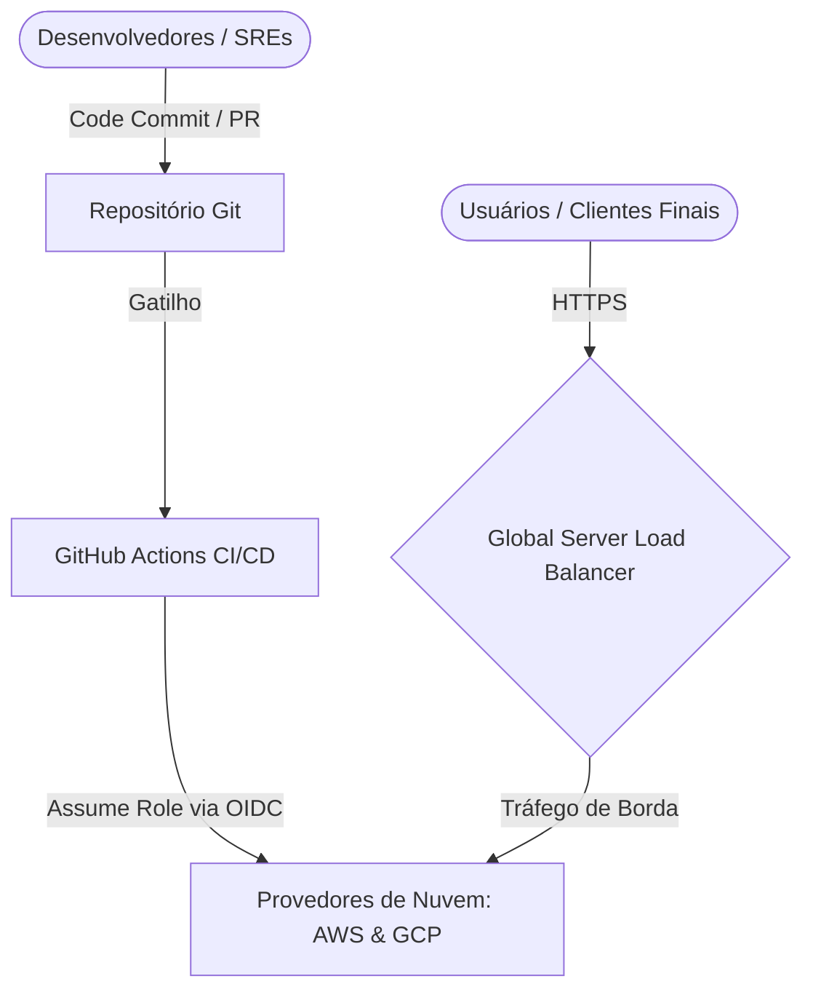
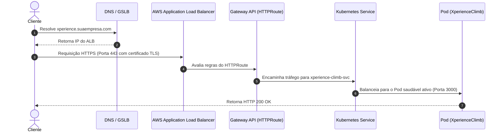

# 🏛️ Documentação de Arquitetura de Software: `template-cluster-kubernetes-ci-cd`

Este documento estabelece as especificações de design de sistema, os padrões de engenharia e os pilares de infraestrutura para o projeto **`template-cluster-kubernetes-ci-cd`**, que atua como o acelerador de plataforma (Platform Accelerator) multi-cloud da organização.

---

## 🎯 1. Visão Geral e Propósito

### Resumo Executivo
O provisionamento, atualização e manutenção de clusters de Kubernetes corporativos enfrentam historicamente dores associadas ao acoplamento de provedor, complexidade no roteamento de tráfego (Ingress legados), vulnerabilidades devido ao uso de credenciais de CI/CD estáticas, e a dificuldade de sustentar múltiplas nuvens sob a mesma governança.

O `template-cluster-kubernetes-ci-cd` resolve estes desafios fornecendo um acelerador pronto para produção, auto-atendido e declarativo. Ele viabiliza clusters escaláveis e seguros, abstraindo a infraestrutura e acelerando o onboarding de microsserviços por meio de um caminho pavimentado (Golden Path).

```text
 ┌──────────────────┐       ┌─────────────────┐       ┌──────────────────┐
 │  Infraestrutura  │ ────► │  Plataforma     │ ────► │  Workloads       │
 │  (OpenTofu/IaC)  │       │  (GitOps / CD)  │       │  (Gateway/Pods)  │
 └──────────────────┘       └─────────────────┘       └──────────────────┘
```

### Princípios Norteadores de Arquitetura
*   **Decoupling (Desacoplamento)**: Separação estrita entre a camada de infraestrutura física (IaC), as aplicações globais de plataforma (Ingress Controllers, CNI, Observabilidade) e os workloads de negócios das equipes de desenvolvimento.
*   **GitOps por Padrão**: Toda a configuração do estado do cluster, desde aplicações até recursos auxiliares, é declarada e reconciliada automaticamente a partir do Git via ArgoCD.
*   **Zero-Trust Security**: Autenticação sem senha usando OIDC para automações (GitHub Actions) e Pod Identity Agent (EKS) / Workload Identity (GKE) para cargas de trabalho em execução, eliminando segredos estáticos.
*   **API-Driven Modern Networking**: Substituição completa dos Ingress tradicionais por recursos desacoplados e baseados em papéis fornecidos pela Kubernetes Gateway API.

---

## 🌐 2. Visão de Componentes e Topologia (Modelo C4)

### Nível 1: Diagrama de Contexto
O diagrama a seguir descreve a interação dos atores externos com a plataforma:



### Nível 2: Diagrama de Contentores e Serviços
A organização interna do cluster e seus serviços auxiliares:

```mermaid
graph TB
    subgraph Provedor de Nuvem AWS / GCP
        subgraph Kubernetes Cluster (EKS / GKE)
            subgraph Namespace: argocd
                Argo[ArgoCD Controller]
            end

            subgraph Namespace: kube-system
                ALB[AWS Load Balancer Controller]
                Cilium[Cilium CNI / Mesh]
                PI[Pod Identity Agent]
            end

            subgraph Namespace: platform-tools
                n8n[n8n Workflow Engine]
            end

            subgraph Namespace: database
                Postgres[PostgreSQL Bitnami]
            end

            subgraph Namespace: apps
                App[XperienceClimb Workload]
            end

            Argo -->|Sincroniza| ALB
            Argo -->|Sincroniza| Cilium
            Argo -->|Sincroniza| Postgres
            Argo -->|Sincroniza| n8n
            Argo -->|Sincroniza| App
        end

        S3[(AWS S3 / GCP Storage)] <-->|Backups Velero| EKS
        Secrets[(AWS Secrets Manager)] <-->|External Secrets| App
    end
```

### Nível 3: Fluxo de Dados, Rede & Roteamento (Inbound)
Detalhamento de como uma chamada de rede externa de borda (por exemplo, acessando a API `XperienceClimb`) transita pelo cluster até atingir o pod da aplicação:



---

## 🛠️ 3. Camada de Infraestrutura e GitOps

### Organização da Infraestrutura como Código (IaC)
A infraestrutura utiliza o **OpenTofu** (ou Terraform) e está estruturada de forma modular para fácil manutenção e isolamento de estado:

*   **Módulos (`terraform/modules/`)**: Contêm definições parametrizadas reusáveis de infraestrutura:
    *   `vpc`: Cria redes virtuais isoladas com subnets públicas, privadas e NAT Gateways.
    *   `eks`: Instancia clusters elásticos de Kubernetes na AWS, incluindo managed node groups configurados com tags de autoscaling e o Pod Identity Agent.
    *   `gke`: Instancia o cluster GKE correspondente no GCP com suporte a Workload Identity para redundância e capacidade multi-cloud nativa.
    *   `aks`: Instancia o cluster AKS na Azure com Azure AD Workload Identity.
    *   `pod-identity`: Configura mapeamentos de roles do IAM.
*   **Ambientes Live (`terraform/live/`)**: Instanciam os módulos passando parâmetros reais de forma segregada e isolada para `dev` e `prod`, armazenando o estado (`terraform.tfstate`) em buckets S3 persistentes e seguros com locking via DynamoDB.

### Estratégia de Deploy e Sincronização GitOps
O cluster adota o padrão GitOps usando o ArgoCD:
1.  **Bootstrapping com `ApplicationSet`**: O arquivo `root-application-set.yaml` monitora dinamicamente os clusters registrados no ArgoCD através de um gerador por rótulos (labels).
2.  **Sincronização Automática (Self-Healing)**: O ArgoCD reconcilia de forma autônoma qualquer desvio de configuração detectado no cluster (drift detection), garantindo que o Git permaneça como a única fonte de verdade.

---

## 🔒 4. Segurança e Gestão de Identidades

### Autenticação de CI/CD sem Senha
As pipelines do GitHub Actions comunicam-se com a AWS sem a necessidade de chaves estáticas (`AWS_ACCESS_KEY_ID`). O pipeline assume roles temporárias do AWS IAM via federação de identidade **OIDC (OpenID Connect)**. O GitHub emite um token assinado por workflow que é trocado por credenciais de curta duração junto ao STS da AWS.

### Identidade de Cargas de Trabalho (Workloads)
*   **AWS (Pod Identity Agent)**: Os Pods assumem roles IAM diretamente sem precisar expor variáveis estáticas. A associação é mapeada via `aws_eks_pod_identity_association`, onde o agente integrado injeta credenciais STS temporárias diretamente nos containers em tempo de execução.
*   **GCP (Workload Identity)**: No GCP, o GKE mapeia as ServiceAccounts do Kubernetes com as Service Accounts do Google Cloud IAM, permitindo que os workloads consumam serviços GCP de forma segura e transparente.

### Proteção de Dados e Gestão de Segredos
*   **External Secrets Operator (ESO)**: Em vez de commitar secrets de banco de dados ou chaves de API em formato base64 no Git, a plataforma instala o ESO.
*   O ESO monitora um `ClusterSecretStore` integrado diretamente ao AWS Secrets Manager. Ele sincroniza dados de forma segura, gerando segredos dinâmicos e efêmeros no Kubernetes apenas em runtime.
