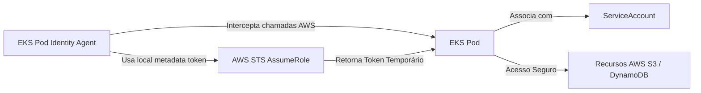

# 📖 Manual Completo da Plataforma (Platform Engineering Handbook)

Bem-vindo ao **Manual da Plataforma de Kubernetes e CI/CD Multi-Cloud**. Este documento foi elaborado com o papel de Engenheiro Principal de Plataforma e Arquiteto de Nuvem para servir como guia oficial de arquitetura, governança e operação do projeto **`template-cluster-kubernetes-ci-cd`**.

---

## 🎯 1. Visão Geral da Plataforma (IDP Vision)

Esta plataforma foi desenhada sob os princípios modernos de **Platform Engineering**, cujo principal objetivo é mitigar a carga cognitiva dos times de desenvolvimento de produto (Devs) através do fornecimento de um caminho pavimentado (Golden Path).

A plataforma oferece de forma auto-atendida e declarativa:
- Recursos de computação seguros e isolados (EKS/GKE).
- Autenticação e autorização robustas, sem chaves estáticas (OIDC + Pod Identity).
- Roteamento de tráfego de entrada desacoplado e performático (Gateway API).
- Provisionamento de banco de dados e outros recursos de infraestrutura via Kubernetes (Crossplane).
- Observabilidade granular nativa (Prometheus + Grafana + Loki).

---

## 🌐 2. Arquitetura de Rede e Tráfego (Kubernetes Gateway API)

O uso de Ingress Controllers tradicionais (como NGINX Ingress) apresentava forte acoplamento entre a infraestrutura do provedor de nuvem e as definições de tráfego de aplicação. A **Kubernetes Gateway API** resolve isso dividindo as responsabilidades em três papéis de usuários fundamentais:

```text
 ┌──────────────────────┐
 │  SRE / Platform Team │ ──► Cria o GatewayClass e Gateway (Define o Load Balancer Físico)
 └──────────────────────┘
            │
            ▼
 ┌──────────────────────┐
 │  App Developer Team  │ ──► Cria o HTTPRoute (Define as regras de caminhos de URL e Backends)
 └──────────────────────┘
```

### Componentes de Tráfego:
1. **`GatewayClass`**: Define o controlador que implementa o Gateway. No nosso caso, é gerenciado pelo `aws-load-balancer-controller` (`eks.amazonaws.com/gateway-controller`).
2. **`Gateway`**: Representa a instanciação do balanceador de carga na infraestrutura (AWS Application Load Balancer ou Network Load Balancer).
3. **`HTTPRoute`**: Expõe caminhos e regras de roteamento (ex: `/api/v1/exemplo` ou `/v1/pagamentos`) e aponta para os Services do Kubernetes.

Um guia prático completo com exemplos e troubleshooting está disponível no [Guia de Adoção Técnica da Kubernetes Gateway API](docs/gateway-api-adoption-guide.md).

---

## 🔑 3. Gestão de Identidades e Permissões (EKS Pod Identity)

Tradicionalmente, a integração de Pods com recursos IAM da AWS exigia o uso de IRSA (IAM Roles for Service Accounts), o que demandava a criação de perfis OIDC complexos e anotações prolixas em ServiceAccounts.

Com o **EKS Pod Identity Agent**, esse processo foi extremamente simplificado e fortalecido:



### Benefícios:
- **Ausência de Segredos Estáticos**: Reduz drasticamente o risco de vazamento de credenciais.
- **Portabilidade**: O código-fonte da sua aplicação permanece limpo e desacoplado da ARN da Role do IAM.
- **Facilidade**: A associação é mapeada no nível do cluster através do recurso `aws_eks_pod_identity_association`.

---

## 🔄 4. Ciclo de Vida e GitOps (ArgoCD & ApplicationSets)

A plataforma utiliza a estratégia de **GitOps** por meio do ArgoCD. Toda a infraestrutura Kubernetes e as ferramentas auxiliares de plataforma são gerenciadas de forma 100% declarativa.

O `ApplicationSet` implementado usa o **gerador por rótulos (labels)** de clusters. Isso significa que, ao registrar um novo cluster no ArgoCD com a label correspondente, o ArgoCD detecta a alteração e provisiona automaticamente:
- **Cilium CNI & Mesh** para interconectividade.
- **AWS Load Balancer Controller** para controle de rede.
- **External Secrets Operator** para gerenciamento de segredos.
- **Prometheus & Grafana** para observabilidade.

---

## 🌍 5. Estratégias Multi-Cloud e Alta Disponibilidade

A plataforma foi arquitetada para mitigar o risco de "Lock-in" de provedor e garantir a máxima resiliência (Disaster Recovery).

```text
                     [ GSLB / DNS Dinâmico ]
                                │
               ┌────────────────┴────────────────┐
               ▼                                 ▼
       [ Região AWS - EKS ]              [ Região GCP - GKE ]
      (Cluster Principal/Ativo)        (Cluster Secundário/Warm)
               │                                 │
         [ Cilium Mesh ] ◄────────────────► [ Cilium Mesh ]
```

### A. Estratégia Ativo-Ativo (Active-Active)
- **Roteamento**: DNS baseado em geolocalização ou latência distribui o tráfego 50/50 entre AWS e GCP.
- **Conectividade**: Cilium Cluster Mesh permite que serviços no GCP se comuniquem de forma direta e segura com serviços na AWS sem NAT.
- **Camada de Banco**: Exige um banco de dados global multi-master distribuído geograficamente (como CockroachDB ou Spanner).

### B. Estratégia Ativo-Passivo (Warm Standby)
- **Funcionamento**: Todo o tráfego flui para a AWS. O cluster GCP GKE permanece ativo em escala reduzida e com réplicas de leitura do PostgreSQL assíncronas.
- **Passo a Passo de Failover**:
  1. Promova a réplica de banco no GCP para Master.
  2. Altere o endpoint de conexão nas secrets no cluster do GCP.
  3. Atualize os apontamentos DNS no GSLB para o Load Balancer do GCP GKE.
  4. Valide a integridade do tráfego das aplicações via `/healthz`.

---

## 📊 6. Governança e Qualidade (OPA / Conftest)

Para evitar desvios de arquitetura e garantir conformidade contínua, os manifestos de aplicações são validados contra políticas estritas declaradas em **Rego (OPA)**.

### Regra Enforcada:
A política `gateway-api-enforcement.rego` bloqueia sumariamente manifestos que utilizam a API antiga de `Ingress`, forçando todos os novos microsserviços a utilizarem a Gateway API (`HTTPRoute` referenciando um `parentRef` de `Gateway` válido).

---

## 📈 7. Sustentação e Monitoramento Operacional

- **Observabilidade**: O monitoramento é baseado no ecossistema Prometheus e Grafana, fornecendo dashboards integrados para acompanhar métricas vitais como uso de CPU, memória, latência de rede e restart de pods.
- **Autoscaling (HPA & Karpenter)**: A escalabilidade ocorre de forma inteligente em duas camadas. Se a CPU passar de 75%, o HPA cria novas réplicas de Pods. Se faltar recursos físicos nos servidores, o Karpenter aloca de forma dinâmica e imediata novas máquinas EC2 otimizadas em menos de 60 segundos.
- **Segurança de Borda (cert-manager & TLS)**: O ciclo de vida dos certificados SSL/TLS da plataforma é gerenciado de forma automatizada pelo `cert-manager` integrado com Let's Encrypt ou AWS Certificate Manager (ACM).

---

## 🛠️ 8. Guia de Configuração e Autenticação Local (AWS SSO)

Para garantir máxima segurança operacional e aderência às melhores práticas do mercado, a plataforma adota a autenticação **exclusiva via AWS SSO** (AWS IAM Identity Center). Isto elimina a necessidade de chaves de acesso estáticas e reduz o risco de credenciais vazadas.

### 📋 Passo a Passo para Configuração

#### Passo 1: Configuração do AWS IAM Identity Center no Portal AWS
1. Acesse o console da AWS e ative o **AWS IAM Identity Center**.
2. No menu lateral, crie seu usuário em **Users** e associe-o a um grupo ou conta.
3. Em **AWS accounts**, selecione a conta que deseja gerenciar e associe o conjunto de permissões desejado (reconhecido como **AdministratorAccess**).
4. Copie a **AWS SSO Start URL** gerada pelo console (exemplo: `https://d-9066799629.awsapps.com/start`).
* 🔗 **Link de Apoio:** [AWS IAM Identity Center Quick Start](https://docs.aws.amazon.com/singlesignon/latest/userguide/get-started-with-identity-center.html)

#### Passo 2: Configuração e Login no AWS CLI Local
1. Com a sua Start URL e Região em mãos, execute no seu terminal o assistente interativo da plataforma:
   ```bash
   make config aws
   ```
   *(ou rode diretamente o comando do AWS CLI: `aws configure sso`)*
2. Quando solicitado, preencha as informações:
   - **SSO session name**: `sso-session` (ou qualquer nome de sua preferência)
   - **SSO start URL**: `https://d-xxxxxxxxxx.awsapps.com/start` (sua Start URL obtida no Passo 1)
   - **SSO region**: `us-east-1` (região onde o SSO está ativado)
3. O AWS CLI abrirá automaticamente uma página no seu navegador web para você autorizar o acesso. Insira as credenciais do seu usuário do IAM Identity Center e valide o código de segurança do terminal.
4. Ao concluir, o terminal exibirá as contas e roles disponíveis. Selecione a sua conta e a role de Administrador.
5. **Atenção:** O AWS CLI criará um perfil nomeado dinâmico em `~/.aws/config`, no formato parecido com `AdministratorAccess-533267373350`.
* 🔗 **Link de Apoio:** [Configuring the AWS CLI to use AWS IAM Identity Center](https://docs.aws.amazon.com/cli/latest/userguide/cli-configure-sso.html)

#### Passo 3: Associação Automática e Persistência de Ambiente
1. Imediatamente após a conclusão do wizard do CLI, o nosso script de automação (`scripts/config-aws.sh`) fará o parsing inteligente do arquivo `~/.aws/config` para extrair o último perfil configurado.
2. O terminal solicitará sua confirmação para utilizar o perfil detectado:
   ```text
   [INFO] Perfil SSO detectado automaticamente: AdministratorAccess-533267373350
   Deseja utilizar este perfil? [Y/n] (padrão: Y): Y
   ```
3. O script salvará essas definições no arquivo local `.aws_profile_env` (que já está devidamente ignorado no `.gitignore`):
   ```ini
   AWS_PROFILE=AdministratorAccess-533267373350
   AWS_REGION=us-east-1
   ```
4. O `Makefile` importará silenciosamente este arquivo por meio de `-include .aws_profile_env` e exportará as variáveis globais `AWS_PROFILE` e `AWS_REGION` de forma automatizada.
5. Toda e qualquer chamada subsequente dos comandos `make` (incluindo o bootstrap do OIDC com OpenTofu/Terraform) herdarão o perfil correto de forma nativa e sem necessidade de novas intervenções.

#### Passo 4: Renovação Automática da Sessão (Self-Healing)
Caso a sua sessão SSO expire após o limite estabelecido de tempo (geralmente entre 1 e 12 horas), os scripts de automação do Makefile detectarão o problema no momento da validação com o STS (`aws sts get-caller-identity`) e iniciarão automaticamente o fluxo de re-autenticação:
```bash
aws sso login --profile "$AWS_PROFILE"
```
Isso garante um fluxo sem interrupções e com segurança impecável.
