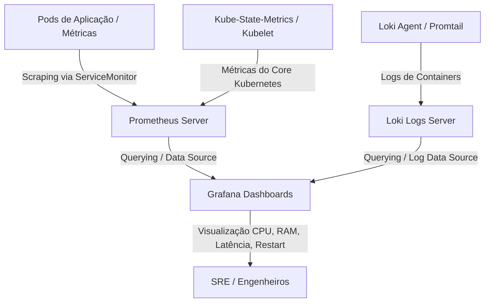
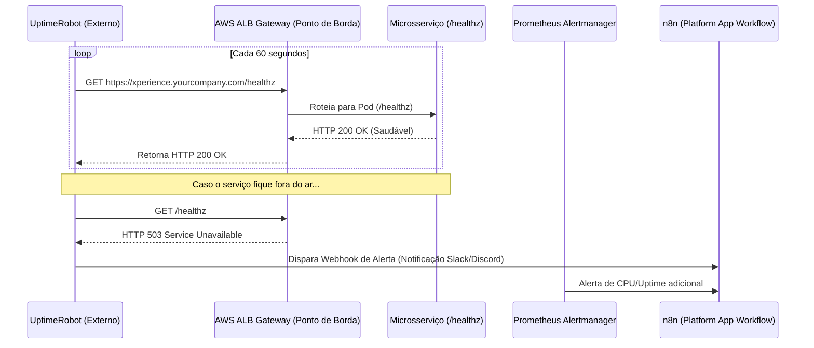
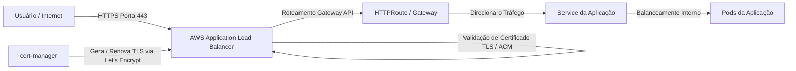
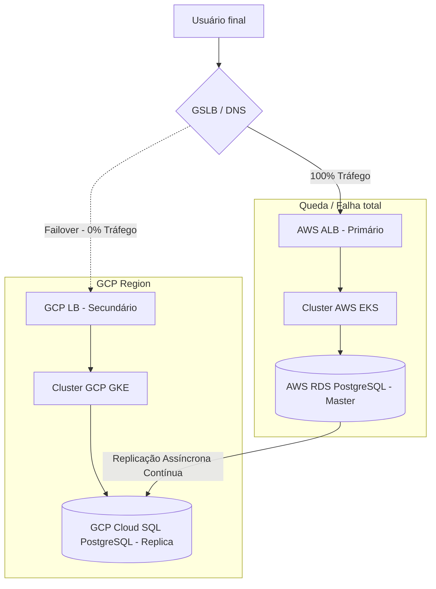

# Template Cluster Kubernetes CI/CD (EKS, GitOps, Gateway API, Pod Identity, OIDC & Crossplane)

Este é um repositório modelo (template) robusto de nível de produção chamado **`template-cluster-kubernetes-ci-cd`**. O objetivo deste projeto é servir de base e acelerador de plataforma (Platform Accelerator) para provisionar, atualizar e gerenciar de forma 100% automatizada clusters Kubernetes escaláveis, seguros e preparados para múltiplos workloads multi-cloud e multi-cluster.

Atuando como um Engenheiro Principal de Plataforma, Arquiteto de Cloud e SRE especialista, esta solução adota as práticas mais modernas e avançadas do ecossistema de infraestrutura como código (IaC), GitOps, controle de qualidade de rede e segurança.

---

## 🛠️ Arquitetura e Padrões Tecnológicos

Esta arquitetura foi desenhada para resolver os problemas comuns de gerenciamento de infraestrutura legada:

1. **Segurança de Identidade sem Senha (AWS OIDC & EKS Pod Identity):**
   - **OpenID Connect (OIDC)**: O pipeline do GitHub Actions autentica-se na AWS assumindo funções IAM dinamicamente através da action `aws-actions/configure-aws-credentials`, eliminando chaves de acesso estáticas e reduzindo drasticamente a superfície de ataque.
   - **Amazon EKS Pod Identity Agent**: Substitui integralmente o padrão IRSA legado. Os Pods agora ganham permissões do IAM de forma simples através do mapeamento direto via agente integrado EKS, utilizando o principal de serviço `pods.eks.amazonaws.com` associado à ServiceAccount.

2. **Roteamento de Tráfego de Entrada Moderno (Kubernetes Gateway API):**
   - Abandona por completo o Ingress NGINX legado em favor da **Kubernetes Gateway API** (`GatewayClass`, `Gateway`, `HTTPRoute`).
   - Integra-se nativamente com o **AWS Load Balancer Controller** para criar e configurar dinamicamente Application Load Balancers (ALB) ou Network Load Balancers (NLB) na AWS de forma declarativa e otimizada.

3. **Plataforma Declarativa e GitOps (ArgoCD & Crossplane):**
   - **ArgoCD Bootstrapping**: Implementação de um `ApplicationSet` mestre que utiliza o **gerador por rótulos (labels)** para descobrir novos clusters e aplicar as ferramentas base (Cilium, AWS Load Balancer Controller, External Secrets Operator).
   - **Cilium Cluster Mesh**: Prepara a comunicação inter-cluster direta e segura para ambientes multi-cloud e multi-região.
   - **Crossplane Compositions**: Abstração de infraestrutura para provisionar e consumir recursos gerenciados multi-cloud de forma nativa e declarativa (ex: Banco de Dados AWS RDS Postgres) usando o Upbound AWS Provider.

4. **Controle de Qualidade Contínuo (OPA Conftest & Terratest):**
   - Validação de políticas de segurança e arquitetura em tempo de CI usando **Open Policy Agent (OPA) / Conftest** para impedir manifestos de Ingress legados.
   - Teste de integração end-to-end automatizado em Go via **Terratest** para provisionar infraestrutura efêmera e validar o funcionamento da rede e permissões IAM.

---

## 📁 Estrutura de Diretórios do Repositório

```text
template-cluster-kubernetes-ci-cd/
├── .github/
│   └── workflows/
│       ├── ci-cd.yml                      # Pipeline de CI/CD sequencial com fail-fast e controle de concorrência
├── terraform/
│   ├── modules/                           # Módulos Terraform reusáveis
│   │   ├── vpc/                           # Provisionamento de Rede (Public/Private subnets, NAT, IGW)
│   │   ├── eks/                           # Cluster EKS, Node Groups e Addons (Pod Identity Agent)
│   │   ├── gke/                           # Cluster GKE no GCP com suporte a Workload Identity
│   │   ├── aks/                           # Cluster AKS na Azure com suporte a AD Workload Identity
│   │   └── pod-identity/                  # Mapeamentos e papéis do EKS Pod Identity
│   └── live/                              # Instanciação por ambientes separados
│       ├── dev/                           # Ambiente de Desenvolvimento (us-east-1 / GCP us-central1)
│       └── prod/                          # Ambiente de Production (us-west-2 / GCP us-west1)
├── crossplane/
│   ├── provider-configs/                  # Configurações de provedores do Crossplane (AWS WebIdentity)
│   └── compositions/                      # Compositions de banco de dados gerenciados (AWS RDS Postgres)
├── platform-apps/
│   ├── bootstrap/                         # Root ApplicationSet para bootstrapping automático
│   │   ├── root-application-set.yaml
│   │   ├── aws-cluster-secret.yaml        # Configuração do cluster AWS no ArgoCD
│   │   ├── gcp-cluster-secret.yaml        # Configuração do cluster GCP no ArgoCD
│   │   └── kustomization.yaml
│   └── infrastructure-apps/               # Aplicações e utilitários de infraestrutura global
│       ├── aws-load-balancer-controller/  # Helm integration para ALB/NLB & Gateway API resources
│       ├── cilium/                        # Helm chart com suporte a Cluster Mesh
│       │   ├── application.yaml
│       │   └── clustermesh-configuration.yaml
│       ├── external-secrets/              # Secrets Operator integrado a Secrets Manager via Pod Identity
│       ├── postgres/                      # Helm chart do PostgreSQL Bitnami (ideal para Dev/Local)
│       ├── n8n/                           # Automação n8n conectada ao Postgres e Gateway API
│       ├── observability/                 # Prometheus, Grafana, Loki / Metrics Server
│       ├── backup/                        # Velero para K8s / Backup de DB
│       ├── cert-manager/                  # Gestão de Certificados TLS (ACM / Let's Encrypt)
│       ├── uptime/                        # Integrador / exporter de Health Checks (Blackbox Exporter)
│       ├── argocd/                        # Auto-gerenciamento do ciclo de vida do ArgoCD
│       └── kustomization.yaml
├── apps-template/                         # Modelo base de onboarding para desenvolvedores
│   ├── base/                              # Manifestos K8s puros (Deployment, Service, HTTPRoute, HPA)
│   │   ├── deployment.yaml
│   │   ├── service.yaml
│   │   ├── http-route.yaml
│   │   ├── hpa.yaml
│   │   └── kustomization.yaml
│   └── overlays/                          # Customizações por ambiente
│       ├── dev/                           # Overlay para o ambiente de desenvolvimento
│       └── prod/                          # Overlay para produção contendo aplicações customizadas
│           └── xperience-climb/           # Deploy da aplicação real XperienceClimb com EKS Pod Identity
└── tests/
    ├── policies/
    │   └── gateway-api-enforcement.rego   # Regras OPA/Conftest impedindo uso de Ingress
    └── integration/
        └── cluster_test.go                # Teste e2e de infraestrutura em Go (Terratest)
```

---

## 🚀 Passo-a-Passo: Configuração do Zero e Primeiro Deploy

### 1. Configurando o OIDC da AWS no GitHub

Para que o GitHub Actions se comunique com a AWS com segurança de forma sem senha e assuma apenas as permissões estritamente necessárias para provisionar a plataforma, siga as regras de **Princípio de Acesso Mínimo** (Least Privilege) detalhadas abaixo:

#### Passo A: Criar o Provedor OIDC (Uma única vez por Conta AWS)
1. Acesse o Console AWS -> **IAM** -> **Identity Providers** -> **Add Provider**.
2. Escolha **OpenID Connect**.
3. **Provider URL:** `https://token.actions.githubusercontent.com`
4. Clique em **Get thumbprint**.
5. **Audience:** `sts.amazonaws.com`
6. Clique em **Add provider**.

#### Passo B: Criar as Policies do IAM com Acesso Mínimo
Não dê `AdministratorAccess` para a Role do GitHub Actions. Em vez disso, crie políticas personalizadas contendo apenas as permissões necessárias para gerenciar os recursos declarados neste template:

1.  **Políticas de Rede (VPC)**: Permissões para criar, modificar e deletar subnets, rotas, NAT Gateways, Internet Gateways e Security Groups.
2.  **Políticas do EKS**: Permissões para gerenciar clusters EKS, Node Groups e associações do Pod Identity Agent (`eks:CreateCluster`, `eks:CreateNodegroup`, `eks:AssociatePodIdentityRole`).
3.  **Políticas do IAM**: Permissões para gerenciar roles dedicadas dos pods e do cluster (`iam:CreateRole`, `iam:PutRolePolicy`, `iam:PassRole`).
4.  **Políticas de S3 e DynamoDB**: Permissões de escrita e leitura sobre o bucket S3 e tabela DynamoDB correspondentes ao backend de estado do OpenTofu (`s3:ListBucket`, `s3:GetObject`, `s3:PutObject`, `dynamodb:GetItem`, `dynamodb:PutItem`, `dynamodb:DeleteItem`).

#### Passo C: Criar as Roles do IAM e suas Trust Policies (Relações de Confiança)
Crie três Roles IAM no seu console (uma para cada ambiente e testes):
- `github-actions-eks-dev-role`
- `github-actions-eks-prod-role`
- `github-actions-eks-test-role`

Anexe as políticas de acesso mínimo criadas no Passo B a cada uma delas.

A **Trust Policy** (Relação de Confiança) deve ser estrita, permitindo que **apenas o seu repositório oficial** e branches autorizadas assumam a Role. Use a seguinte Trust Policy (substituindo `<SUA_CONTA_ID>` pelo ID real da sua conta AWS e `<SEU_USUARIO_OU_ORG>` pelo seu usuário/organização no GitHub):

```json
{
  "Version": "2012-10-17",
  "Statement": [
    {
      "Effect": "Allow",
      "Principal": {
        "Federated": "arn:aws:iam::<SUA_CONTA_ID>:oidc-provider/token.actions.githubusercontent.com"
      },
      "Action": "sts:AssumeRoleWithWebIdentity",
      "Condition": {
        "StringEquals": {
          "token.actions.githubusercontent.com:aud": "sts.amazonaws.com"
        },
        "StringLike": {
          "token.actions.githubusercontent.com:sub": "repo:<SEU_USUARIO_OU_ORG>/template-cluster-kubernetes-ci-cd:*"
        }
      }
    }
  ]
}
```

#### Passo D: Cadastrar os Secrets no seu Repositório GitHub
Para que as pipelines de CI/CD encontrem essas credenciais e rodem com sucesso, acesse a página de configurações do seu repositório no GitHub (**Settings > Secrets and variables > Actions > New repository secret**) e crie as seguintes variáveis secretas:

- **`AWS_REGION`**: ex: `us-east-1` (Região padrão utilizada pelo desenvolvimento e testes)
- **`AWS_REGION_PROD`**: ex: `us-west-2` (Região padrão utilizada pelo ambiente de produção)
- **`AWS_ROLE_TO_ASSUME_DEV`**: ARN completa da Role IAM criada para Desenvolvimento (ex: `arn:aws:iam::<SUA_CONTA_ID>:role/github-actions-eks-dev-role`)
- **`AWS_ROLE_TO_ASSUME_PROD`**: ARN completa da Role IAM criada para Produção (ex: `arn:aws:iam::<SUA_CONTA_ID>:role/github-actions-eks-prod-role`)
- **`AWS_ROLE_TO_ASSUME_TEST`**: ARN completa da Role IAM criada para a suíte de Testes (ex: `arn:aws:iam::<SUA_CONTA_ID>:role/github-actions-eks-test-role`)

Se qualquer uma dessas variáveis estiver vazia ou ausente, a pipeline de CI/CD ativará o mecanismo **Fail-Fast** e abortará a execução imediatamente nos primeiros 2 segundos para garantir total segurança e transparência!

---

### 2. Inicializando e Executando o OpenTofu Localmente
Se preferir rodar as ferramentas localmente usando o binário `tofu` (ou `terraform`):

```bash
# Navegue até o diretório do ambiente desejado (ex: dev)
cd terraform/live/dev

# Inicialize o backend e baixe os providers
tofu init

# Valide a formatação do código
tofu fmt -check

# Execute o plano de infraestrutura
tofu plan -out=tfplan

# Aplique o plano para criar a VPC, Cluster EKS, GKE, e o Pod Identity Agent
tofu apply tfplan
```

### 3. Autenticando e Configurando o Kubeconfig local
Após o apply finalizar com sucesso:

```bash
# Atualize as credenciais locais do Kubernetes apontando para o novo cluster
aws eks update-kubeconfig --name template-eks-cluster-dev --region us-east-1
```

---

## 🌐 Deploy de Plataforma (n8n, Postgres) e Aplicação Customizada (XperienceClimb)

### A. Sequência de Inicialização Automática (GitOps)
Com o cluster ativo e o Kubeconfig configurado, podemos inicializar o fluxo de GitOps. O ArgoCD cuida de toda a plataforma de forma declarativa:

1. **Instale o ArgoCD inicial:**
   ```bash
   kubectl create namespace argocd
   kubectl apply -n argocd -f https://raw.githubusercontent.com/argoproj/argo-cd/stable/manifests/install.yaml
   ```

2. **Aplique o Root ApplicationSet (Bootstrapping):**
   ```bash
   kubectl apply -f platform-apps/bootstrap/root-application-set.yaml
   ```
   *(O ArgoCD lerá as configurações deste repositório e aplicará todas as aplicações de infraestrutura mapeadas em `platform-apps/infrastructure-apps/` de forma dinâmica baseado nas labels do cluster).*

### B. Descrição das Aplicações de Plataforma Iniciadas

- **AWS Load Balancer Controller & Gateway API:** Provisiona a classe de rede `Gateway` nativa.
- **PostgreSQL (Bitnami):** Implantado na namespace `database` usando persistência de volumes, servindo de banco para serviços como o n8n.
- **n8n Workflow Automation:** Instalado na namespace `platform-tools`, conectado ao PostgreSQL via Secret segura, e exposto externamente na URL `n8n.yourcompany.com` através da Gateway API (`HTTPRoute`).
- **XperienceClimb (Aplicação Prod):** Localizado em `apps-template/overlays/prod/xperience-climb/`, representa a sua aplicação real rodando em Produção com alta disponibilidade (2 réplicas) utilizando Pod Identity para acessar serviços AWS adicionais sem chaves estáticas, e exposta via HTTPRoute em `xperience.yourcompany.com`.

Para mais detalhes sobre as práticas de adoção e configuração da Gateway API, consulte o [Guia de Adoção Técnica da Kubernetes Gateway API](docs/gateway-api-adoption-guide.md).

---

## 📖 Como Instalar e Expor Novas APIs/Serviços no Cluster (Guia de Onboarding)

Esta seção detalha o fluxo de onboarding para desenvolvedores. Para implantar uma nova API ou microsserviço (ex: `api-payments`), siga os **4 passos** descritos abaixo:

### Fluxo de Trabalho de Onboarding

```
 ┌─────────────────────────────────────────────────────────┐
 │ 1. Criar Manifestos (baseado em apps-template/)        │
 │    - Deployment + ServiceAccount                        │
 │    - Service (clusterIP)                                │
 │    - HTTPRoute (Kubernetes Gateway API)                 │
 └────────────────────────────┬────────────────────────────┘
                              │
                              ▼
 ┌─────────────────────────────────────────────────────────┐
 │ 2. Adicionar ao ArgoCD (platform-apps/bootstrap/)       │
 │    - Adicionar a pasta/tag da app                       │
 └────────────────────────────┬────────────────────────────┘
                              │
                              ▼
 ┌─────────────────────────────────────────────────────────┐
 │ 3. ArgoCD Sync Automático                               │
 │    - ArgoCD detecta a mudança via GitOps                │
 │    - Instala os recursos no Cluster Kubernetes          │
 └────────────────────────────┬────────────────────────────┘
                              │
                              ▼
 ┌─────────────────────────────────────────────────────────┐
 │ 4. Entrada de Tráfego & Permissões AWS                  │
 │    - Gateway API associa o HTTPRoute ao AWS ALB         │
 │    - Pod Identity libera acesso AWS (S3, Dynamo, etc)   │
 └─────────────────────────────────────────────────────────┘
```

#### Passo 1: Criar Manifestos baseados em `apps-template/`
Crie uma pasta para a sua nova aplicação em `apps-template/overlays/dev/api-payments` contendo os seguintes arquivos básicos:

##### 1. `deployment.yaml` + `ServiceAccount`
Caso sua aplicação precisa acessar recursos AWS, declare a `ServiceAccount` para que ela seja associada ao **EKS Pod Identity**:
```yaml
apiVersion: v1
kind: ServiceAccount
metadata:
  name: api-payments-sa
  namespace: dev
---
apiVersion: apps/v1
kind: Deployment
metadata:
  name: api-payments
  namespace: dev
spec:
  replicas: 2
  selector:
    matchLabels:
      app: api-payments
  template:
    metadata:
      labels:
        app: api-payments
    spec:
      serviceAccountName: api-payments-sa
      containers:
        - name: api
          image: 123456789012.dkr.ecr.us-east-1.amazonaws.com/api-payments:v1.0.0
          ports:
            - containerPort: 8080
```

##### 2. `service.yaml` (Exposição Interna)
```yaml
apiVersion: v1
kind: Service
metadata:
  name: api-payments-svc
  namespace: dev
spec:
  type: ClusterIP
  selector:
    app: api-payments
  ports:
    - port: 80
      targetPort: 8080
```

##### 3. `http-route.yaml` (Exposição Externa via Kubernetes Gateway API)
Associe a sua rota ao `Gateway` gerenciado pelo AWS Load Balancer Controller:
```yaml
apiVersion: gateway.networking.k8s.io/v1
kind: HTTPRoute
metadata:
  name: api-payments-route
  namespace: dev
spec:
  parentRefs:
    - name: main-aws-alb-gateway
      namespace: kube-system
  hostnames:
    - "api.dev.yourcompany.com"
  rules:
    - matches:
        - path:
            type: PathPrefix
            value: /v1/payments
      backendRefs:
        - name: api-payments-svc
          port: 80
```

#### Passo 2: Registro no ArgoCD (GitOps)
Crie um arquivo Application no ArgoCD declarando sua nova app ou configure o seu `root-application-set.yaml` para rastrear dinamicamente o novo path:

```yaml
apiVersion: argoproj.io/v1alpha1
kind: Application
metadata:
  name: api-payments-dev
  namespace: argocd
spec:
  project: default
  source:
    repoURL: 'https://github.com/your-org/template-cluster-kubernetes-ci-cd.git'
    targetRevision: HEAD
    path: 'apps-template/overlays/dev/api-payments'
  destination:
    server: 'https://kubernetes.default.svc'
    namespace: dev
  syncPolicy:
    automated:
      prune: true
      selfHeal: true
```

#### Passo 3: Sincronização Automática
Realize o commit e envie um Pull Request para a branch `main`. Quando o PR for mesclado:
- O ArgoCD detecta a nova declaração e instala os manifestos automaticamente.
- O AWS Load Balancer Controller configura dinamicamente o ALB na AWS, roteando o tráfego de `/v1/payments` para os pods da `api-payments`.
- O Pod Identity injeta os tokens AWS STS válidos no runtime do pod de forma 100% segura.

---

## 📖 Guia Operacional da Plataforma

Esta seção documenta a sustentação operacional da infraestrutura de cluster e das aplicações instaladas.

### 1. Como Funciona a Observabilidade (Fluxo de Coleta e Monitoramento)

O monitoramento do cluster baseia-se na coleta contínua de métricas por agentes e servidores Prometheus e Grafana:



- **Métricas Baselines**: O Kubernetes Metrics Server expõe os consumos de recursos em tempo real (`kubectl top nodes/pods`).
- **Loki & Grafana**: Consolidação unificada de Logs e Métricas de performance de tráfego que cruzam a Gateway API.

### 2. Monitoramento de Uptime & Alertas (UptimeRobot)

O monitoramento de disponibilidade (uptime) das aplicações baseia-se na verificação de endpoints de saúde específicos expostos pela Gateway API e integrados ao UptimeRobot:



**Configuração do UptimeRobot:**
- **Tipo de Monitoramento**: HTTP(s).
- **URL**: `https://xperience.yourcompany.com/healthz`.
- **Intervalo de Monitoramento**: 1 minuto.
- **Alertas**: Em caso de falha, dispara uma chamada HTTP POST (Webhook) para o n8n ou envia diretamente um e-mail/notificação no canal do Slack.

### 3. Rotina de Backups e Restauração de Desastres (Velero & RDS Snapshots)

A integridade do estado e configuração do Kubernetes é garantida em duas frentes independentes:

#### Para Recursos e Configurações K8s (via Velero)
- **Backup**: O Velero captura backups agendados de manifestos e dados armazenados em Volumes Persistentes (EBS PVs), enviando-os para um bucket S3 criptografado.
- **Restauração**:
  ```bash
  # Recuperar todo o cluster a partir do último backup disponível
  velero restore create --from-backup backup-diario-completo
  ```

#### Para Banco de Dados (PostgreSQL / RDS)
- **RDS (via Crossplane)**: Habilita backups automáticos (Point-in-Time Recovery - PITR) com retornabilidade de 7 a 30 dias. Snapshots diários redundantes são criados na AWS.
- **PostgreSQL In-Cluster (Dev/Local)**: Um CronJob executa o `pg_dump` de hora em hora e envia o dump comprimido e criptografado para o S3:
  ```bash
  # Para restaurar o banco in-cluster a partir do S3
  aws s3 cp s3://template-backups/postgres-latest.sql .
  kubectl exec -i statefulset/postgresql-dev-0 -n database -- psql -U postgres n8n < postgres-latest.sql
  ```

### 4. Regras de Escalonamento (Autoscaling de 2 Camadas)

- **Camada de Pods (HPA)**: Ajusta o número de pods horizontalmente. O Horizontal Pod Autoscaler monitora as metas de utilização (como as definidas no `apps-template/base/hpa.yaml` de 75% CPU e 80% RAM). Caso o consumo passe desse limite, novos Pods são agendados.
- **Camada de Nós (Karpenter / EKS Managed Node Groups)**: Se não houver capacidade física de nós para acomodar os novos pods pendentes (`Pending`), o Karpenter se conecta à API do EC2 e provisiona instantaneamente novos servidores (instâncias Spot ou On-Demand baseadas em preço/perfil), reduzindo o tempo de boot de nós para menos de 60 segundos.

### 5. Fluxo de Entrada de Tráfego com Gateway API & TLS Ativo

O fluxo de segurança de tráfego de borda até as aplicações é estruturado da seguinte forma:



---

## 🌍 Estratégias Multi-Cloud e Disaster Recovery

Este projeto é totalmente compatível e modular para suportar alta disponibilidade geográfica e multi-nuvem redundante.

### A. Cenário Ativo-Ativo (Active-Active)

Neste cenário, dois clusters Kubernetes (AWS EKS e GCP GKE) rodam a aplicação simultaneamente em produção, atendendo requisições com base em proximidade geográfica ou latência via DNS dinâmico:

```mermaid
graph TD
    User[Usuário final na Internet] -->|Requisição| GSLB{Global Server Load Balancer <br> Cloudflare / Route53}
    GSLB -->|50% Tráfego - Menor Latência| ALB[AWS ALB - Gateway API]
    GSLB -->|50% Tráfego| GCLB[GCP Load Balancer - Gateway API]

    subgraph Cluster AWS (Primary)
        ALB --> AppAWS[Pods da Aplicação - AWS]
        AppAWS -->|Acesso Direto à Rede via Cilium Mesh| AppGCP
    end

    subgraph Cluster GCP (Secondary)
        GCLB --> AppGCP[Pods da Aplicação - GCP]
    end

    subgraph Camada de Dados Global
        AppAWS -->|Leitura / Escrita local| CockroachDB[Banco de Dados Distribuído Ativo-Ativo <br> CockroachDB / Spanner]
        AppGCP -->|Leitura / Escrita local| CockroachDB
    end
```

- **Requisito de Estado**: Exige banco de dados multi-master de baixa latência (como CockroachDB ou AWS Aurora Global Database) para evitar divergências de escritas simultâneas.
- **Rede Inter-Cluster**: O **Cilium Cluster Mesh** fornece criptografia mútua (Wireguard/IPSec) e roteamento IP direto de pod a pod entre AWS e GCP sem NAT.

### B. Cenário Ativo-Passivo (Active-Passive / Warm Standby)

Nesta estratégia, todo o tráfego atinge o cluster primário (AWS). Se houver uma falha total da região AWS, o tráfego é roteado para o cluster secundário (GCP):



#### Roteiro de Failover Manual/Automatizado

Caso ocorra um desastre na AWS, o failover operacional é executado através dos seguintes passos:

1. **Promover Banco de Dados Secundário**:
   - Promova a réplica de leitura do PostgreSQL no GCP/região secundária para se tornar o Banco de Dados Master oficial para escritas.
2. **Atualizar Configuração de Secrets**:
   - Ajuste as Secrets do Kubernetes no cluster secundário (`GCP`) via ArgoCD/External Secrets para apontar a URL de conexão para o novo Endpoint Master.
3. **Mudar Direcionamento de Tráfego GSLB (DNS)**:
   - Altere a rota de tráfego do DNS (Cloudflare/Route53) apontando o tráfego principal de `xperience.yourcompany.com` para o endereço IP do Load Balancer do GCP GKE.
4. **Verificação de Saúde**:
   - Rode o teste automatizado para confirmar que os pods estão saudáveis, respondendo a requisições com código HTTP 200, e processando escritas.

### C. Matriz de Decisão: Ativo-Ativo vs. Ativo-Passivo

| Critério | Ativo-Ativo (Active-Active) | Ativo-Passivo (Active-Passive / Warm Standby) |
| :--- | :--- | :--- |
| **RPO (Recovery Point Objective)** | Praticamente 0 (Gravação imediata em banco distribuído). | < 5 a 15 minutos (tempo de replicação assíncrona do banco). |
| **RTO (Recovery Time Objective)** | < 1 minuto (Failover imediato via DNS/GSLB sem downtime). | 5 a 15 minutos (Tempo para promoção do banco e alteração DNS). |
| **Complexidade** | Extrema. Exige tratamento de conflitos de escrita e rede mesh. | Média. Simples replicação de leitura e redirecionamento DNS. |
| **Custos de Infraestrutura** | Muito Altos (2x custos de recursos e banco de dados ativo-ativo). | Moderados (Réplicas menores ou paradas com ativação por demanda). |

---

## 🧪 Execução de Testes e Validações

### A. Testes de Políticas OPA / Conftest
As políticas Rego garantem a proibição do uso de recursos `Ingress` e forçam o uso de `HTTPRoute` e Gateway API.

```bash
# Certifique-se de que o conftest está instalado e execute:
conftest test --policy tests/policies/ apps-template/base/
conftest test --policy tests/policies/ apps-template/overlays/prod/xperience-climb/
```

### B. Testes de Integração E2E via Terratest (Go)
Para rodar os testes de integração efêmeros que criam o cluster temporário, aplicam os templates, validam a injeção do Pod Identity e testam a conectividade HTTP:

```bash
# Navegue até o diretório de testes
cd tests/integration

# Inicialize o módulo Go e execute
go mod tidy
go test -v -timeout 60m -run TestE2ECluster
```

---

## 🔒 Segurança e Governança

- **Verificação Estática (Trivy & TFSec)**: Executados a cada PR no arquivo `.github/workflows/ci-cd.yml` para auditar configurações incorretas e vulnerabilidades de segurança nos pacotes e arquivos HCL.
- **Isolamento de Credenciais**: Nenhuma chave ou segredo da AWS é exposto no código ou armazenado nos ambientes do GitHub Actions graças à autenticação federada (OIDC) e STS Pod Identity.
